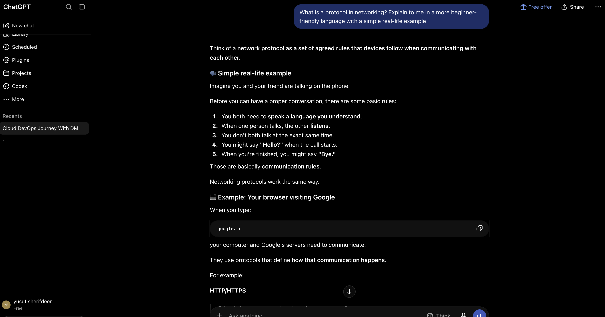
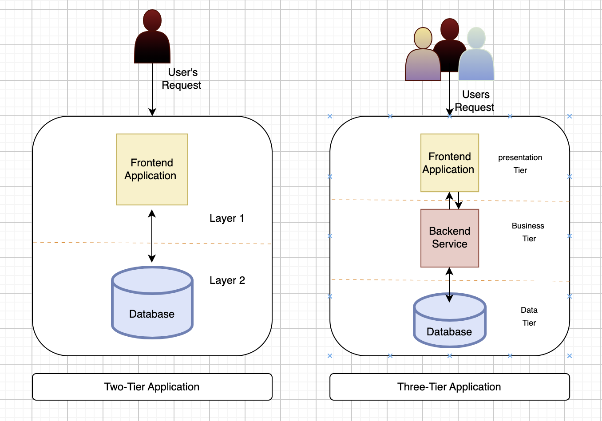
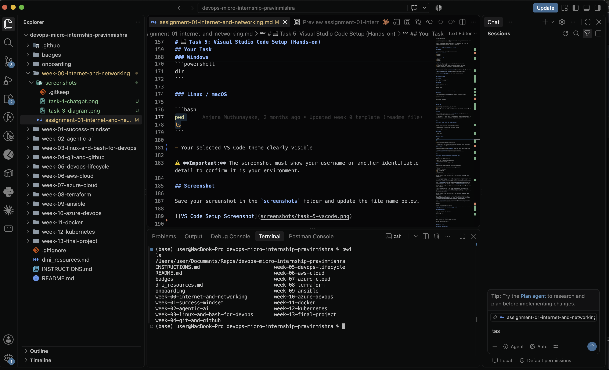

# Week 00 - Internet and Networking

Part of the DevOps Micro Internship (DMI) with Agentic AI

---

# 🧑‍💻 Task 1: Using ChatGPT as Your Learning Assistant

## Scenario

You're new to DevOps and will frequently encounter technical questions. ChatGPT can be your learning companion.

## Your Task

Write a clear ChatGPT prompt to help you understand:

> "What is a protocol in networking? Explain with a simple real-life example."

Take a screenshot of your interaction showing:

- Your detailed prompt (with clear expectations)
- ChatGPT's simplified response with an example

## Screenshot

Save your screenshot in the `screenshots` folder and update the file name below.



Replace `task-1-chatgpt.png` with your actual screenshot file name.

---

## What I Learned (2–3 lines)

I learned that a protocol in networking is a set of agreed rules that devices on a network follow so that communication can take place successfully.

There are many networking protocols, including TCP/IP, UDP, HTTP, HTTPS, FTP, and TLS, among others. Each protocol has a specific purpose in communication.

For example, when a device communicates with a server over the internet, the TCP/IP protocols are commonly involved in delivering the data between them. If the communication involves accessing a web page, HTTP is used to define how the web request and response should be handled. When security is required, HTTPS is used, which is essentially HTTP communication secured using TLS.

---

# 🌐 Task 2: Internet and Networking

## Scenario

Your friend is launching an online bookstore named **EpicReads**.

He asked you to explain how users globally can access his website hosted in Finland.

## Your Task

Write a short explanation (**100–150 words**) that includes:

- Packet Switching
- IP Address
- TCP/IP
- HTTP/HTTPS

💡 **Tip:** You may use ChatGPT (as demonstrated in Task 1) to refine your explanation.

## Answer

Users around the world can access the EpicReads website even though it is hosted on a server in Finland. When a user enters the website address, DNS resolves the domain name to the server’s IP address, which identifies where the website is hosted.

Once the IP address is known, TCP/IP handles the communication between the user's device and the server. TCP helps ensure that the data is delivered reliably and in the correct order, while IP is responsible for addressing and routing the packets to their destination.

The website's data is sent using packet switching, where the data is divided into smaller packets that can travel across different network paths before reaching the server, where they are reassembled.

Finally, HTTP handles the web communication. If the website uses HTTPS, the communication is also encrypted and secured using TLS.

---

# 🏗️ Task 3: Application Architecture & Stack

## Scenario

EpicReads bookstore has two application versions:

### Two-Tier Application

- Frontend
- Database

### Three-Tier Application

- Frontend
- Backend
- Database

## Your Task

- Draw simple diagrams (hand-drawn or tool-based such as draw.io)
- Label each layer clearly
- List at least two common technologies or tools used for each layer
- Submit a screenshot or photo clearly showing your own drawing

## Diagram Screenshot / Photo

Save your diagram image in the `screenshots` folder and update the file name below.



Replace `task-3-diagram.png` with your actual diagram file name.

---

## Technologies Used

### Frontend

Javascript, React, Tailwind css
Axios, React context API

### Backend

Express Js, Bycrpt, Rest API

### Database

Mongodb, Mysql

---

# 🌍 Task 4: Domain Name & DNS (Basic Concepts)

## Scenario

Your friend's bookstore **EpicReads** is currently accessible through:

```text
52.172.142.222:3000
```

He purchased the domain:

```text
epicreads.com
```

## Your Task

In **50–100 words**, explain in your own words:

1. What is DNS (Domain Name System)?
2. Which DNS record type should be used to connect the domain to the given IP, and why?

## Answer

DNS (Domain Name System) is like the internet’s phonebook. It translates human-readable domain names, such as `epicreads.com`, into IP addresses that computers use to locate the correct server.

For EpicReads, an A record should be used because it connects a domain name to an IPv4 address. The A record would point epicreads.com to 52.172.142.222. However, DNS only maps the domain to the IP address; the :3000 is a port number and is handled separately by the server and network configuration.

---

# 💻 Task 5: Visual Studio Code Setup (Hands-on)

## Your Task

Install Visual Studio Code (if not already installed).

Take a screenshot of your VS Code environment showing:

- Terminal open inside VS Code
- Running a basic command:

### Windows

```powershell
dir
```

### Linux / macOS

```bash
pwd
ls
```

- Your selected VS Code theme clearly visible

⚠️ **Important:** The screenshot must show your username or another identifiable detail to confirm it is your environment.

## Screenshot

Save your screenshot in the `screenshots` folder and update the file name below.



Replace `task-5-vscode.png` with your actual screenshot file name.

---

# 🔗 Task 6: Publish Your Assignment as a LinkedIn Post

## Objective

Publishing on LinkedIn helps you:

- Build your professional online presence
- Reinforce your learning
- Document your DevOps journey publicly

## Your Task

Summarize your answers from Tasks 1–5 into a LinkedIn post.

Clearly structure your post into the following sections:

- ChatGPT
- Internet & Networking
- App Architecture
- DNS
- VS Code Setup

Use the credit note that matches your track:

Add the following credit note at the end of your post **(If you are DMI Cohort 3 student)**:

> **P.S. This post is part of the DevOps Micro Internship (DMI) with Agentic AI — Cohort 3 — by Pravin Mishra. My graded progress is public: https://dmi.pravinmishra.com/s/YOUR-GITHUB-USERNAME.html · Start your DevOps journey: https://dmi.pravinmishra.com/?utm_source=student&utm_medium=ps-linkedin&utm_campaign=cohort3**

**Tag [Pravin Mishra](https://www.linkedin.com/in/pravin-mishra-aws-trainer/) in your LinkedIn post, then tag Lead Co-Mentor — [Anjana Muthunayake](https://www.linkedin.com/in/anjana-muthunayake/).**

Add the following credit note at the end of your post **(If you are DMI Self-paced track student)**:

> **P.S. This post is part of the DevOps Micro Internship (DMI) — Self-Paced Engineer Track — by Pravin Mishra. My graded progress is public: https://dmi.pravinmishra.com/s/YOUR-GITHUB-USERNAME.html · Start your DevOps journey: https://dmi.pravinmishra.com/?utm_source=student&utm_medium=ps-linkedin&utm_campaign=self-paced**

Add the following credit note at the end of your post **(If you are DMI Campus student)**:

> **P.S. This post is part of the DevOps Micro Internship (DMI) — Campus — by Pravin Mishra. My graded progress is public: https://dmi.pravinmishra.com/s/YOUR-GITHUB-USERNAME.html · Start your DevOps journey: https://dmi.pravinmishra.com/?utm_source=student&utm_medium=ps-linkedin&utm_campaign=campus**

**Tag [Pravin Mishra](https://www.linkedin.com/in/pravin-mishra-aws-trainer/) in your LinkedIn post, then tag Lead Co-Mentor — [Anjana Muthunayake](https://www.linkedin.com/in/anjana-muthunayake/).**

Hashtags:

#DMIByPravinMishra #AgenticAI #DevOps

## Replace `YOUR-GITHUB-USERNAME` with your GitHub username — that link is your public DMI progress page (your graded badge page).

## LinkedIn Post URL

Paste your LinkedIn post URL here:

https://www.linkedin.com/posts/yusuf-sheriffdeen-203199185_dmi-devops-dmi-share-7508867650723389441-qGtK/?utm_source=share&utm_medium=member_desktop&rcm=ACoAACuhsuMBb3yMV1YnsyLi5GNpnlG7ejmS4sc

---

## LinkedIn Post Backup Copy

Paste the full text of your LinkedIn post here:

I’m taking another big step in my **Cloud & DevOps journey.** 🚀

Just a few months ago, I concluded the **BaseStack Academy AWS Cloud Accelerator (Cohort 1)**, where I got hands-on experience with AWS services ranging from VPCs, EC2, Load Balancing, databases, and different types of storage.

It was a program I really enjoyed because it gave me much more exposure to how applications can be moved to the cloud and served to millions of users across the globe.

But the course answered only one part of my question:

**What happens when demand keeps growing and you need to automate everything?**

That’s where the second half comes in.

I want to go deeper into **DevOps**, and I think I’ve found the right place to do that: **DMI (DevOps Micro Internship).**

I’ve recently been seeing posts from DevOps engineers who went through DMI, so I joined the waiting list, and now it’s finally about that time to begin.

The curriculum is well structured and very hands-on. For **Week 0**, we went through some important fundamentals as a refresher:

### 🤖 ChatGPT

Using AI tools like ChatGPT the right way, understanding prompt engineering, and learning how these tools can support me in understanding difficult concepts and improving productivity.

### 🌐 Internet & Networking

How does the internet actually work?

The internet is essentially a **network of networks**, where devices communicate using agreed rules called protocols.

I revisited concepts such as **TCP/IP**, IP addressing, packet switching, TCP’s three-way handshake, and UDP.

TCP focuses on reliable delivery, while UDP provides faster, lower-overhead communication where some packet loss may be acceptable, such as in video calls and VoIP.

We also looked at protocols such as **HTTP, HTTPS, FTP, and SSH**.

### 🏗️ App Architecture

I looked at some common application architectures, including **two-tier, three-tier, and microservices architectures**, and how the different components of an application communicate with each other.

### 🌍 Domain Names & DNS

One of the examples I found interesting was understanding how a website like **EpicReads** could be accessed by users around the world.

Imagine the website is currently accessible through:

`http://52.172.142.222:3000/`

but the owner wants users to access it through:

`epicreads.com`

This is where **DNS** comes in.

DNS is like the internet’s phonebook. It translates a human-readable domain name into the IP address that machines use to locate the server.

Once the destination is known, **TCP/IP** handles the communication, while packet switching allows the data to travel across networks in smaller packets.

And when the website uses **HTTPS**, the communication is encrypted and secured using **TLS**.

Also, the `:3000` is the **port number**, which identifies the network endpoint where the application is listening on that server.

### 💻 VS Code Setup

I also set up my development environment and became familiar with the tools and workflow I’ll be using throughout this journey.

Week 0 looks simple on paper, but it reminded me of something important:

**DevOps isn’t just about learning tools. It’s about understanding how systems actually work.**

This is just the beginning, and I’m looking forward to seeing how much deeper this journey takes me.

Thank you to **Pravin Mishra** and **Anjana Muthunayake** for putting this together.

P.S. This post is part of the **DevOps Micro Internship (DMI) with Agentic AI — Cohort 3 — by Pravin Mishra. My graded progress is public:**
https://dmi.pravinmishra.com/s/YOUR-GITHUB-USERNAME.html

**Start your DevOps journey:**
https://dmi.pravinmishra.com/?utm_source=student&utm_medium=ps-linkedin&utm_campaign=cohort3

#DevOps #DMI #DevOpsJourney #CloudComputing #AWS #SoftwareEngineering

---

# Reflection – Week 0

### What did you find easy?

I found the basic networking concepts relatively easy because of my previous experience as a software engineer. Understanding concepts such as protocols, IP addresses, DNS, TCP/IP, HTTP/HTTPS, and how they work together was straightforward. I was also able to relate the concepts to things I have already encountered when building and deploying applications.

---

### What was difficult?

What I found difficult was understanding some of the networking concepts in greater depth, especially how DNS resolution works and how packets are routed between different networks. I understood the basic ideas, but connecting the different stages together and understanding what happens behind the scenes required more thought and research.

---

### What will you improve next week?

Next week, I want to improve my understanding of networking fundamentals, especially DNS, IP addressing, TCP/IP, and how packets move between networks. I also want to spend more time practicing these concepts rather than only learning them theoretically, so I can better understand how they apply in real-world environments.

---

## 📌 About DMI & CloudAdvisory

DevOps Micro Internship (DMI) is a project-based DevOps program run by Pravin Mishra (The CloudAdvisory) focused on real-world execution, systems thinking, and career readiness.

It helps learners build strong DevOps foundations with hands-on experience.

## 📌 Resources

- 🌐 **DMI Official Website:** https://dmi.pravinmishra.com?utm_source=github&utm_medium=readme
- 🎓 **University:** https://university.pravinmishra.com?utm_source=github&utm_medium=readme
- 💬 **Discord Community:** https://discord.pravinmishra.com?utm_source=github&utm_medium=readme
- 📝 **Blog:** https://dmi.pravinmishra.com/blog?utm_source=github&utm_medium=readme
- ▶️ **YouTube Playlist (DMI Cohort 3):** https://www.youtube.com/playlist?list=PLFeSNDtI4Cho
- 🔗 **Pravin Mishra (LinkedIn):** https://www.linkedin.com/in/pravin-mishra-aws-trainer/
- 🏢 **CloudAdvisory (LinkedIn):** https://www.linkedin.com/company/thecloudadvisory/

---

_This submission is part of DevOps Micro Internship (DMI) — Agentic AI Track_
